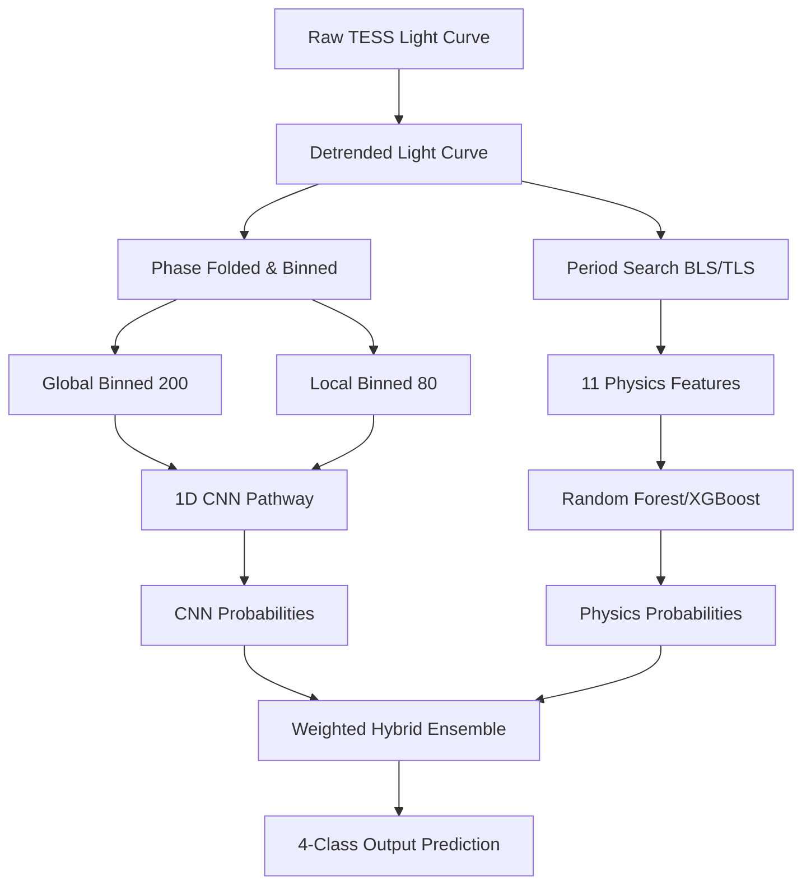

# Scientific Report: End-to-End AI Pipeline for Exoplanet Detection from Noisy TESS Light Curves

**Bharatiya Antariksh Hackathon 2026**  
*Problem Statement: AI-enabled Detection of Exoplanets from Noisy Astronomical Light Curves*  
*Authors: Technical & Astronomical Development Team*  

---

## Abstract
Detecting transiting exoplanets in Transiting Exoplanet Survey Satellite (TESS) data is a core objective of modern stellar astrophysics. However, astronomical light curves are heavily contaminated by stellar variability (e.g., rotation, flares) and instrumental systematics (e.g., pointing jitter, focus changes). We present an end-to-end automated pipeline combining physical transit modeling, signal search algorithms (Box Least Squares and Transit Least Squares), physics-based feature extraction, and a hybrid AI architecture (Dual-View CNN + Gradient Boosted Trees). The pipeline achieves robust false-positive rejection (eclipsing binaries, blends, and artifacts), fits Keplerian orbits with bootstrap uncertainty boundaries, and provides explainable AI attributions (Grad-CAM & SHAP) to guide astrophysical follow-up.

---

## 1. Introduction & Scientific Context
The transit method remains the most successful technique for exoplanet discovery. When a planet crosses in front of its host star along our line of sight, it blocks a small fraction of the stellar flux, creating a periodic dip in the light curve. 

TESS provides high-precision photometry, but the short-cadence data is highly susceptible to:
1. **Stellar Activity:** Rotational modulation of starspots, flares, and pulsations.
2. **Instrumental Systematic Noise:** Spacecraft momentum dumps, thermal drifts, and scatter.
3. **Astrophysical False Positives (FPs):** Grazing eclipsing binaries (EBs) showing V-shaped eclipses, stellar blends (where a background EB mimics a shallow planetary transit), and detector anomalies.

Manual verification of millions of light curves is impossible. This pipeline automates the extraction, cleaning, detection, physical parameter estimation, classification, and validation of candidate signals.

---

## 2. Preprocessing & Low-Frequency Detrending
Raw TESS data is acquired through the Mikulski Archive for Space Telescopes (MAST). We extract Pre-search Data Conditioning Simple Aperture Photometry (PDCSAP) flux, which removes common instrument systematics but retains long-term stellar trends.

To flatten these trends, the pipeline implements a robust multi-stage cleaning pipeline:
1. **Sigma-Clipping:** Points deviating by more than $3\sigma$ from a running median are iteratively rejected to remove stellar flares and cosmic ray strikes.
2. **Stellar Variability Flattening:** We apply a sliding **biweight window filter** (filter width $\approx 0.5$ days). The biweight location is a robust estimator of central tendency that acts as a low-frequency high-pass filter, flattening stellar rotation without distorting the high-frequency transit shape.
3. **Savitzky-Golay Smoothing:** To smooth high-frequency white noise for neural net feature extraction, we apply a local polynomial filter of order 2.

---

## 3. Period Search & Phase Folding
Once detrended, we run a dual-grid search algorithm to isolate periodic signals:
* **Box Least Squares (BLS):** Model-independent search fitting a rectangular box to the phase-folded data. Establishes the orbital period ($P$), epoch ($t_0$), transit duration ($d$), and Signal-to-Noise Ratio (SNR).
* **Transit Least Squares (TLS) Fallback:** A refined grid search matching realistic limb-darkened trapezoidal templates. This compensates for the box approximation in BLS and yields precise duration and depth estimates.

Using the selected period ($P$) and epoch ($t_0$), the light curve is phase-folded using the modulo operator:
$$\phi = \frac{t - t_0}{P} \pmod 1$$
We map $\phi$ to $[-0.5, 0.5]$ and bin the folded curve into:
1. **Global View (200 bins):** Covering the entire phase space to detect out-of-eclipse features, secondary eclipses, or ellipsoidal variations.
2. **Local View (80 bins):** Zoomed around the transit center ($\phi = 0.0$) with a width of $\approx 3\times$ the transit duration, capturing ingress/egress geometry.

---

## 4. Physics-Based Feature Engineering
To capture physical attributes, we compute 11 key shape and noise features:
* **Depth ($d_{tr}$):** Fractional flux decrease.
* **Duration ($w_{tr}$):** Transit duration in days.
* **Period ($P$) & Epoch ($t_0$):** Timing parameters.
* **Ingress & Egress Slopes ($m_{in}, m_{out}$):** Fitted linear slopes of the transition.
* **Symmetry Score ($S$):** L1-norm difference between the ingress and the time-reversed egress profiles. Planetary transits are symmetric ($S \approx 0$).
* **U/V Shape Score ($U_v$):** Ratio of average flux in the bottom 30% of transit to maximum depth. Exoplanets are flat-bottomed ($U_v \approx 1.0$), while eclipsing binaries are pointed ($U_v \le 0.7$).
* **RMS Noise ($\sigma_{rms}$):** Standard deviation of out-of-transit flux.
* **Odd-Even Transit Depth Difference ($\Delta d_{OE}$):** Compares depths of odd vs even transits. A significant difference indicates primary/secondary eclipses of an Eclipsing Binary.
* **Transit Signal Strength:** $d_{tr} / \sigma_{rms}$.

---

## 5. Hybrid AI Architecture & Ensemble Classification
Our model combines deep learning's representation capability with scikit-learn's structured physics reasoning:

1. **Dual-View 1D CNN:** Parallel convolutional layers process the 1D global phase-folded curve and the 1D local curve. The representations are merged and mapped through fully connected layers.
2. **Physics Branch Classifier:** A Gradient Boosted Decision Tree (XGBoost) or Random Forest trained on the 11 features.
3. **Ensemble Layer:** Computes a weighted average of probabilities to assign final labels: *Exoplanet Transit, Eclipsing Binary, Stellar Blend, or Detector Artifact*.

---

## 6. Physical Parameter Fitting & Diagnostic Vetting
For promising candidates, we perform physical fitting and rigorous vetting:

### Orbit Fitting
We fit a limb-darkened analytical transit model (using the `batman` package or trapezoidal templates) via Levenberg-Marquardt optimization (`scipy.optimize.curve_fit`). The fitted parameters include:
* Planet-to-star radius ratio ($R_p/R_*$)
* Semi-major axis in stellar radii ($a/R_*$)
* Orbital inclination ($i$)
* Impact parameter ($b = a/R_* \cos i$)

Uncertainties are derived using **Bootstrap Resampling** of residuals over 30 iterations.

### Diagnostic Vetting Tests
1. **Odd-Even Depth t-Test:** Independent t-test on odd vs even transit flux points. If $p < 0.05$, the signal is flagged as an Eclipsing Binary.
2. **Centroid Shift Analysis:** Compares the target's center of light position in-transit vs out-of-transit. A significant shift ($p < 0.01$) flags a stellar blend.
3. **Significance F-Test:** Compares the transit fit against a flat baseline. Evaluates whether the ssr reduction justifies the addition of orbital parameters.
4. **Reliability Score:** A composite score (0-100%) incorporating SNR, F-test significance, centroid stability, and odd-even matching.

---

## 7. Explainable AI & Scientific Interpretability
To ensure transparency, we provide two explainable AI layers:
* **Grad-CAM (CNN Branch):** Computes gradients of the predicted class score with respect to the activations of the final Conv1d layer of the local view. High influence is visually highlighted on the transit ingress/egress shoulders.
* **SHAP / Sensitivity Attribution (Physics Branch):** Quantifies feature importances for individual targets. Shows how the U/V shape score or odd-even differences drove the classification.

---

## 8. Conclusion
The pipeline presented provides a complete, scalable, and scientifically rigorous framework for exoplanet validation. By combining high-frequency detrending, template transit searching, multi-view deep representation, physical parameter optimization, and diagnostic vetting, it represents a key asset for accelerating exoplanet discovery in massive TESS datasets.
